# An ESP32 based audio book player build from existing electronics modules
**THIS REPO IS WIP. FILES/INFORMATION ARE ADDED STEP BY STEP**

A device that is meant to play non-DRM audio books from an SD card and has the following features:  

- folder based audio book player, one folder contains all files of one audio book
- multiple audio books supported
- sorting of audio book names and audio book files by ASCII name (see limitations of sorting below)
- saves audio book listening position and resumes for each audio book
- supports huge single file audio books, e.g. a 20hrs long singe file audio book
- file formats AMR-WB, MP3 and OGG
- ASCII character based menu driven UI for 16x4 character screen
- single rotary knob navigation
- sleep timer 1...99min, wakeup timer 1min...24hr
- auto power off
- firmware upgrades from SD card
- based on pure esp-idf + esp-adf
- plays 50hrs+ with 2500mAh 18650 battery
- endless options of integrations with speakers/cases
  
It tries to follow the design principle of
[doing one thing and doing that well](https://en.wikipedia.org/wiki/Unix_philosophy).
  
# The working prototypes
development board:
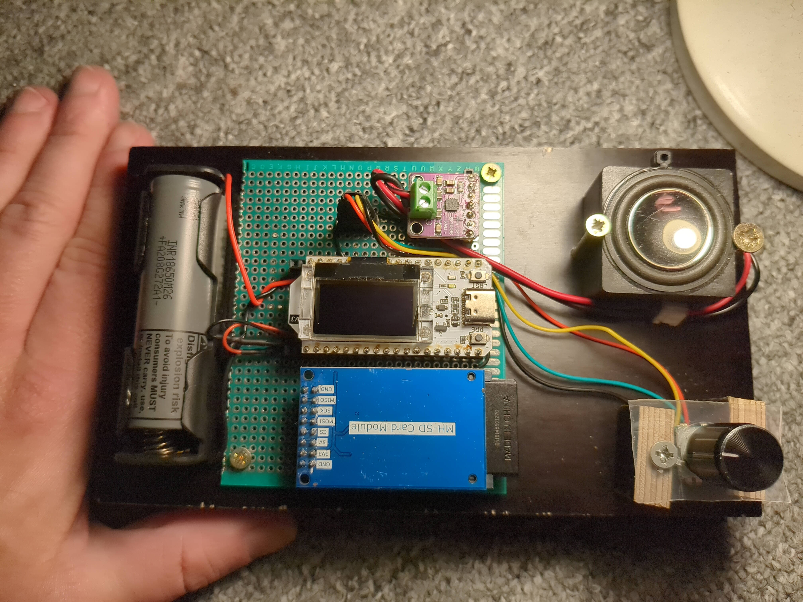  
  
integrated in an old speaker that otherwise might have landed in the trash:  
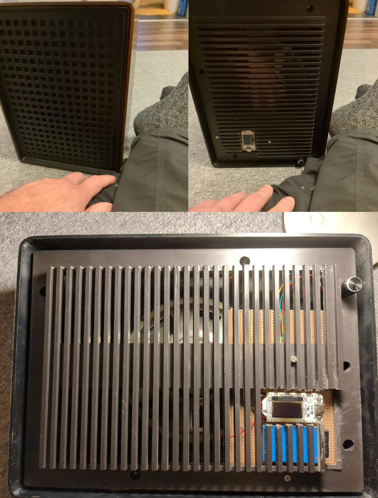  
  
the portable/smaller prototype version:  
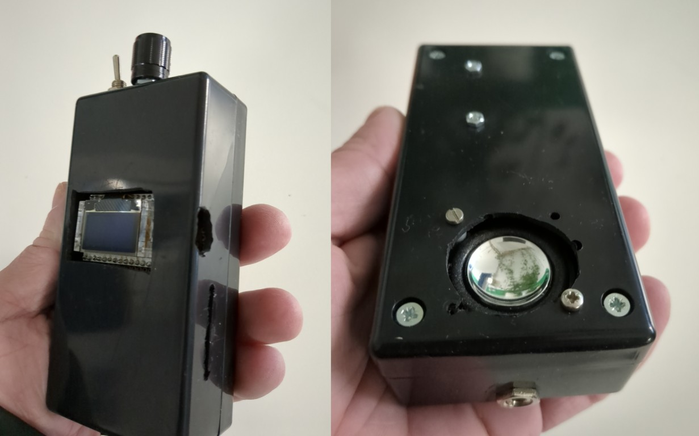  
  
[first poc](pictures/first_poc.jpg)
  
# Why?
Currently (2023) one really needs to search hard to find an offline only non tracking audio book player that is
able to play files from huge SD cards and at the same time sorts the files based on their name and remembers and
resumes the last listening position.  
Many people nowadays will use subscription services with corresponding apps on their smartphone. These services
and the apps usually track the users. The can also be canceled at any time. May it be for politics or economic
reasons. They usually do not allow you own the audio book but only sell a license to listen at it for as long
as the company exists or is allowed to do business with you.  
I have an audio book collection that I created by only buying if I can download the files or
copy them e.g. from a CD to keep them. Without DRM.  
All my audio books are converted to and then stored in AMR-WB as for me the quality with 24kBit/s mono is good enough.
This shrinks an MP3 file to approx. 1/10ths when using AMR-WB and also makes the backup cheap. One CD with AMR-WB
can hold 60hrs, a DVD 350hrs, a 25GB BD-R 2000hrs+.  
Using existing electronics hardware modules and the software of this repository I can now build a device that
just plays my audio books. Not more, not less. And it most likely will do so in 30years assuming nothing breaks.
There are still 30yrs+ old Nintendo Gameboys that work like a charm and are being refurbished.  
Additionally I can change the behavior of the software as I like. The whole development environment works offline
and can also be installed in an offline virtual machine and will still be able to compile even if the
hardware manufacturer of the main controller board does not exist anymore.  
  
# Videos
Download and watch:  
[Scenario1](https://github.com/lanmarc77/esp-audio-book-player/raw/main/videos/scenario1.mp4): normal operation  
[Scenario2](https://github.com/lanmarc77/esp-audio-book-player/raw/main/videos/scenario2.mp4): seeking  
[Scenario3](https://github.com/lanmarc77/esp-audio-book-player/raw/main/videos/scenario3.mp4): sorting  
[Scenario4](https://github.com/lanmarc77/esp-audio-book-player/raw/main/videos/scenario4.mp4): auto bookmarks  
[Scenario5](https://github.com/lanmarc77/esp-audio-book-player/raw/main/videos/scenario5.mp4): sleep timer  
[Scenario6](https://github.com/lanmarc77/esp-audio-book-player/raw/main/videos/scenario6.mp4): wakeup timer  
[Scenario7](https://github.com/lanmarc77/esp-audio-book-player/raw/main/videos/scenario7.mp4): firmware upgrade  
  
# Hardware
The build only needs a few components that are manufactured by companies in mass and therefore cheap.  
For PCB based components the schematics are available in the module datasheets folder.  
  
**Main controller board:**  
The main controller board is a Heltec WiFi Kit 32 V3. It was chosen because it has a very small deep sleep
current of about 10µA. I measured 15µA with nothing connected to it. Still very good. It already comes with
the circuitry to connect and charge a rechargeable battery as well as the possibility to disconnect other
components from power by using a software programmable power pin (Ve).  
Finally an OLED display is also already available for the UI.  
Be aware that you buy V3 of this board version as it has the low deep sleep current. Otherwise your battery
looses way too much energy even if you do not use the player. Additionally verify that you also get a fitting
battery cable.  
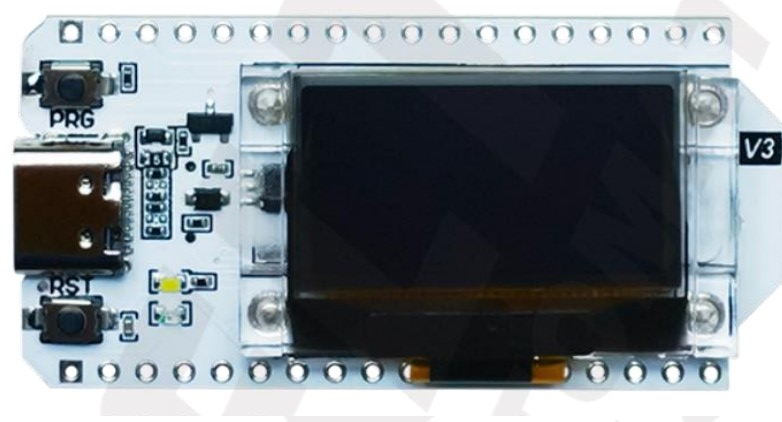  
Typical price in Germany incl. tax (2023): 20€. 
  
**I²S digital analog audio converter**  
Currently only a MAX98357A based converter has been tested extensively. Also an UDA1334A was tested and it worked.
The MAX98357A already contains an amplifier to directly connect it to a speaker and get a usable volume out
of it.  
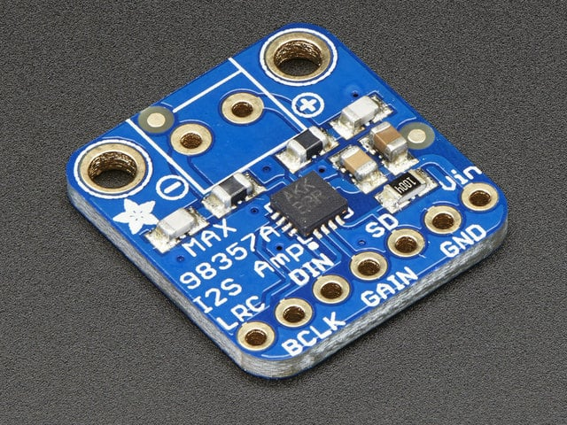  
Typical price in Germany incl. tax (2023): 8€. 
  
**SD card holder**  
I still had old big SD cards laying around so I started with a big SD card holder. They also exists in
micro sd card format. I used this model as it comes with the needed pullup resistors already on the PCB.
Additionally I removed the voltage regulator that is used to convert 5V to 3.3V as I drive the board already
with 3.3V and it consumed around 2mA if back fed. I tested SD cards up to 256GB with this board and they worked.  
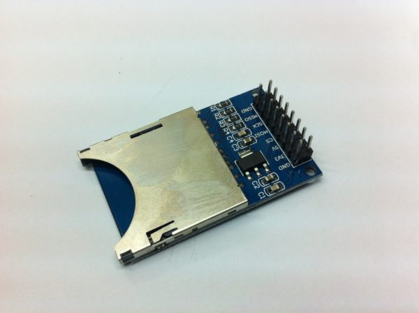  
Typical price in Germany incl. tax (2023): 1.5€. 
  
**Battery and holder**  
Any LiIon battery can be used. I tried 18650 and 14500 without any problems. I suggest trusted dealers as
there are many cheap fake batteries.  
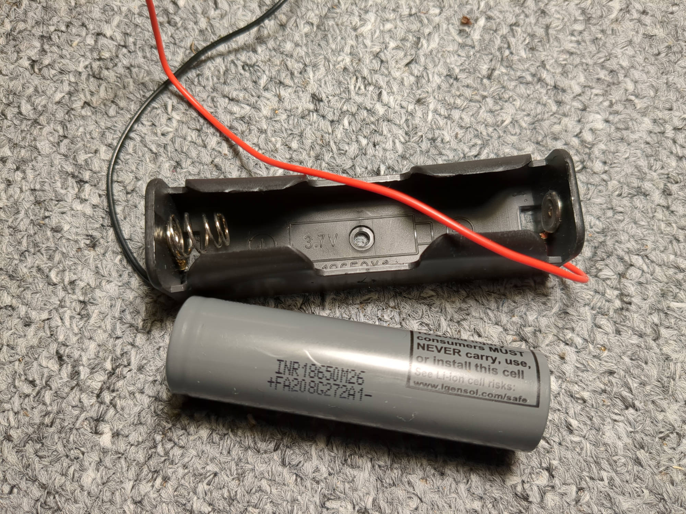  
Typical price in Germany for both incl. tax (2023): 8€. 
  
**Rotary knob**  
To minimize wiring and drilling work I decided for a single rotary knob as main navigation option. This model
has an integrated switch. I suggest to buy a version that comes with the washer/nut/cap.  
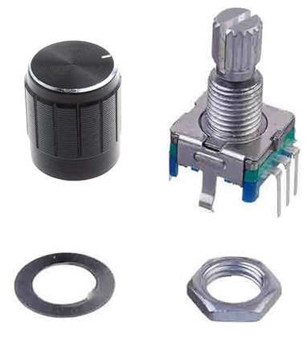  
Typical price in Germany incl. tax (2023): 1€. 
  
**PCB**  
The prototypes as seen above use half or full size euro card PCBs. Any will do for manual wiring. You would
use the full size if you need the extra space for mounting it inside e.g. a speaker.  
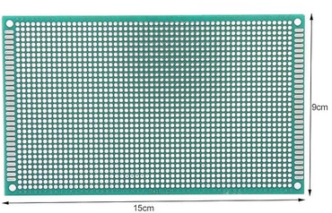  
Typical price in Germany incl. tax (2023): 2€. 
  
## Wiring diagram
Click on the picture for zoom.  
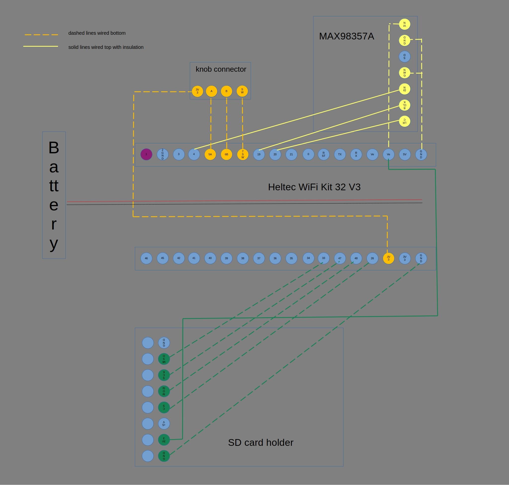  
  
The original .odt file of this drawing is in the `src`directory.  
  
Pictures of manually wired PCB:  
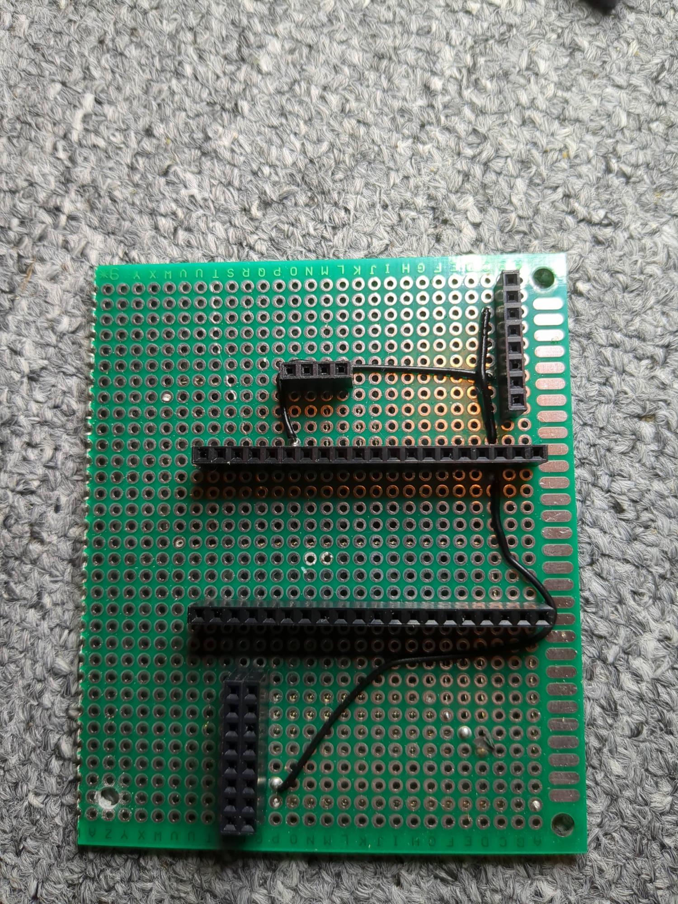  
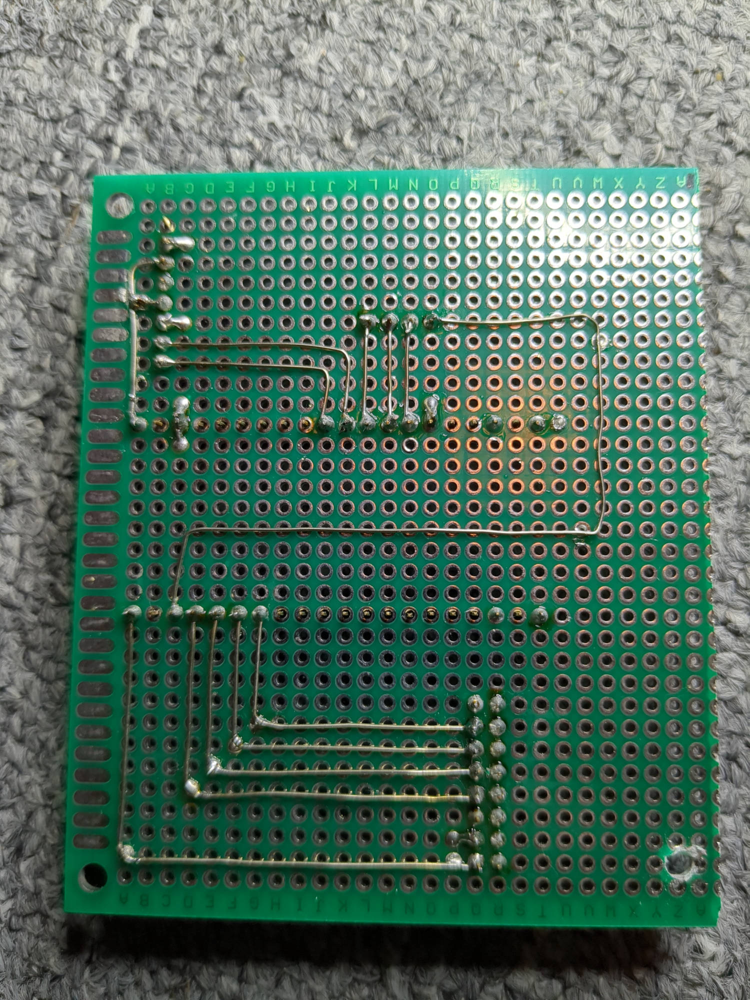  
  
These PCBs have headers for the components. You can leave these out but then need to make sure in 
which order you solder the wires as you might not get to them anymore.   
  
## Printed buyable PCB
TODO
  
## Printed/buyable case
TODO
  
## Current measurements / battery life
The runtime of the system is highly dependent on the current consumption. The current consumption depends on the
type of audio played and mostly the volume. The following measurements were made using the
setup prototype development board as seen above with 8 Ohm speaker OWS-131845W50A-8, 3.7V, 4GB class 10 Transcend
microSD. An UNI-T UT61E with a 22µF tantal smoothing capacitor to handle the current peaks was used.  

  
| scenario                             | volume setting  | current |
|--------------------------------------|-----------:|------------:|
| switched off                         |  0%  | 19µA   |
| switched on, not playing, display on |  0%  | 37ma   |
| switched on, not playing, display off|  0%  | 34ma   |
| 128kbit/s mp3 44100 khz              | 50%  | 42ma   |
| 64kbit/s mp3 44100 khz               | 50%  | 42ma   |
| 128kbit/s mp3 22050 khz              | 50%  | 39ma   |
| 64kbit/s mp3 22050 khz               | 50%  | 39ma   |
| 128kbit/s ogg 44100 khz              | 50%  | 44ma   |
| 64kbit/s ogg 44100 khz               | 50%  | 44ma   |
| 128kbit/s ogg 22050 khz              | 50%  | 41ma   |
| 64kbit/s ogg 22050 khz               | 50%  | 41ma   |
| 24kbit/s amr 16000 khz               | 50%  | 41ma   |
| 128kbit/s mp3 44100 khz              | 75%  | 51ma   |
| 64kbit/s mp3 44100 khz               | 75%  | 51ma   |
| 128kbit/s mp3 22050 khz              | 75%  | 50ma   |
| 64kbit/s mp3 22050 khz               | 75%  | 50ma   |
| 128kbit/s ogg 44100 khz              | 75%  | 52ma   |
| 64kbit/s ogg 44100 khz               | 75%  | 52ma   |
| 128kbit/s ogg 22050 khz              | 75%  | 52ma   |
| 64kbit/s ogg 22050 khz               | 75%  | 52ma   |
| 24kbit/s amr 16000 khz               | 75%  | 52ma   |
| any file from before                 | 100% | ~105mA |
  
At high volumes the energy needed by the speaker dominates the current consumption. Also the current is
not very stable and highly depends on the content that is actually played.  
The volume setting actually follows an x⁴ curve for translating % into power to fit our hearing.  
  
An 18650 battery with 2500mAh will most certainly hold 50hrs assuming average volume levels between 50%...75%.  
  
# UI navigation / usage manual
TODO
  
# Uploading initial binary release
For a brand new main controller board an initial upload is needed. This initial upload will setup the correct
partition details and installs the firmware for the first time. After this initial upload firmware upgrades
via the SD card are possible.  
The binary release files in the [release](https://github.com/lanmarc77/esp-audio-book-player/releases) section:  
  
- bootloader.bin
- partition-table.bin
- ota_data_initial.bin
- esp32_player.bin
  
are to be used for this initial upload.  

## Linux and Windows
For Linux and Windows the Espressif esptool.py can be used. It can be installed by following [this guide](https://docs.espressif.com/projects/esptool/en/latest/esp32/).  
A Windows Comport driver can be found in the `src` directory.  
  
The command line for the initial upload should look like this:  
`
esptool.py -p [YOUR PORT e.g. COM7 or /dev/ttyUSB0] -b 460800 --before default_reset --after hard_reset --chip esp32s3 write_flash --flash_mode dio --flash_freq 80m --flash_size 4MB 0x0 bootloader.bin 0x10000 esp32_player.bin 0x8000 partition-table.bin 0xd000 ota_data_initial.bin
`  
  
Since v00.00.03 firmware upgrades are possible via SD card if this initial upload was done.  
  
## Windows using the Flash Download Tools
Espressif also offers the Windows only Flash Download Tools package with a graphical user interface.  
It can be downloaded from [here](https://www.espressif.com/en/support/download/other-tools).  
A Windows Comport driver can be found in the `src` directory.  
  
The following settings need to be made for the initial upload:  
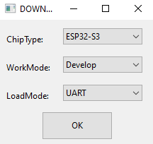  
Select the correct COM port after making the settings as seen below and press START:  
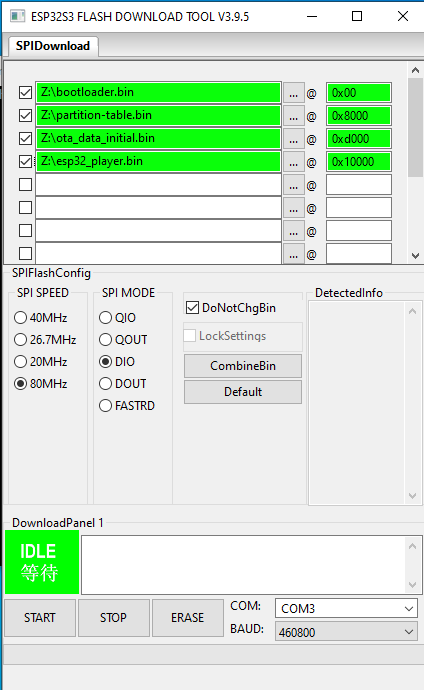  
Ideally no errors are shown and the initial upload is finished.  
  
# FW upgrade using SD card (incl. rollback support)
For upgrading firmware once the initial upload was done only one specific file from the
[release section](https://github.com/lanmarc77/esp-audio-book-player/releases) is needed: XX.XX.XX_ota.fw  
XX are letters from A-F or/and numbers from 0-9 specifying the firmware version of this release.  
Place the file on the SD card in a folder called `fwupgrade`. Once you start the device it should
present you with the upgrade screen. The upgrade screen is left without upgrading if no user interaction is
happening for 10s.  
If you wish to upgrade shortly press the knob button. A countdown of 10s gives you the possibility
to stop the upgrade if you press the knob button. Once the upgrade started you can not interrupt it.
The actual writing process for the upgrade takes around 10s and the progress is shown.  
  
If everything worked you should now see the device restart with the new firmware version but it displays
"TEST" instead of "ok" in the initial firmware version screen during startup.  
"TEST" means that the new firmware is not yet persisted. In this test state you have the possibility
to test everything and check if the new version suits your needs.  
You can persist the new firmware by manually switching the device off by long pressing the knob button
in the audio book selection screen.  
If you do not want to keep the new version and rollback you need to wait for the
device to auto power off which usually happens after 1 minute with no user interaction. Once auto powered off and
afterwards started again the old version should be activated again.  
  
# Compilation hints
Currently used espressif sdk versions:  
esp-idf:  v5.1.1/commit e088c3766ba440e72268b458a68f27b6e7d63986  
esp-adf:  v2.6/commit 49f80aafefc31642ea98db78bf024e18688b8de9  
  
Needed for exFAT:   
To enable exFAT file esp-idf/components/fatfs/src/ffconf.h needs to edited and macro FF_FS_EXFAT needs to be set 1.  
  
Optionally for more privacy:  
The esp-adf unnecessarily links the nghttp component which on every compilation checks with the servers for updates.
To disable delete file idf_components.yml in components/esp-adf-libs/ and change the COMPONENT_REQUIRES in CMakeLists.txt
so that no nghttp is present anymore. Now complete offline compilation is possible.  
  
Take a look into the `src/patches/` directory for more details and .patch files to apply to above sdk versions.
  
# Software architecture
  
```

 -----------------
|   ssd1306*.*    |           -----------------------
|                 |          |       battery.*       |
| low level I²C   |          |                       |
| functions for   |          | monitors, filters     |
| OLED and fonts  |          | and offers the        |
|                 |          | current battery level |
 -----------------           |                       |
         ^                   | uses task             |
         |                   |                       |
         | calls              -----------------------
         |                     ^
 --------------------          |
|   ui_elements.*    |         | calls
|                    |         |
| offers reusable    |         |
| UI elements        |         |                                       --------------------------
|                    |         |    ---------------------------       |         sd_play.*        |
 --------------------          |   |     rotary_encoder.*      |      |                          |
           ^                   |   |                           |      | plays files from SD card |
           |                   |   | low level rotary encoder  |      | using esp-adf pipelines  |
           | calls             |   | and switch handling       |      |                          |
           |                   |   |                           |      |                          |
 ------------------------      |   | uses task + interrupt     |      | uses tasks               |
|       screens.*        |     |   |                           |      |                          |
|                        |     |    ---------------------------        --------------------------
| creates and displays   |     |     ^                                  ^                       |
| complete screen        |     |     |                                  |                       |
| layouts                |     |     | calls                            | calls                 |
|                        |<-   |     | queue communication              | queue communication   |
 ------------------------   |  |     |                                  |                       |
                            |  |     |           -----------------------                        |
                      calls |  |     |          |                                               |
                            |  |     v          v                                         calls |
 -----------             --------------------------                                             |
|   main.*  |           |        ui_main.*         |             --------------------------     |
|           |  calls    |                          |            |      format_helper.*     |<---
|  basic    | --------> |    main player logic     |    calls   |                          |
|  board    |           |                          | ---------> | functions to get audio   |
|  init and |           |   state machine based    |            | format specific          |
|  deinit   |           |                          |            | information like         |
|           |           |                          |            | runtime and bitrate      |
 -----------            |                          |            |                          |
                        |                          |             --------------------------
       ---------------- |                          |
      |                 |                          |<-----------
      |                  --------------------------             |
      |                                |                        |
      | calls                          | calls                  | calls +
      |                                |                        | queue communication
      v                                v                        v
 --------------------         ----------------------         -----------------------------
|     sd_card.*      |       |        saves.*       |       |        ff_handling.*        |
|                    |       |                      |       |                             |
|  low level SPI     |       | handles save         |       | reads and sorts dirs/files  |
|  bus handling and  |       | restore and house    |       | an returns sorted lists     |
|  VFS mount/umount  |       | keeping of bookmarks |       |                             |
|                    |       | and player settings  |       | uses task for sorting       |
 --------------------        |                      |       |                             |
                              ----------------------         ------------------------------

```  
The following sub chapters will give an insight into each shown component and its architecture ideas.  
This layout shows the ideal model that only very rarely is broken in the code.  
  
## main.*
The entry point of the application. It initializes the board and sets up the CPU, disables WiFi and
hands over to the other components.  
Function main() is never left but if other components finish powers off the board and sets up a
wake up timer if needed.  
  
## ui_main.*
This component implements the main player logic. A state machine represents the navigation of the user
and the state the player is currently in.  
As the central component it makes direct use of a all the other components.  
  
## sd_card.*
This component initializes the SPI bus for usage with an SD card and tries to mount the SD card
into the ESPs VFS so it can be used by all other components using file access functions.  
  
## rotary_encoder.*
This component initializes and monitors the rotary encoder and switch using a task and and interrupt.  
Events are generated and placed as messages into a queue for communicating with other components.  
  
## battery.*
This component initializes and monitors the AD converter for monitoring the battery level.  
There are two battery levels available. With slower noise filtering and with faster more noisy filtering.  
A task samples the battery voltage every 500ms.  
  
## screens.*, ui_elements.*, ssd1306*.*
This collection of components uses a typical layered approach.  
The ssd1306 functions give access to a physical display. Here the OLED of the board.  
The ui_elements functions use the ssd306 functions to offer reusable UI elements like text output or
progress meters with which larger screen layouts can be built.  
The screens functions use the ui_elements functions to create a complete screen layout for the player.  
It is assumed that the display can handle a layout of 16x4 ASCII characters.  
  
## saves.*
This component handles the storage, retrieval and house keeping of bookmarks and the settings (like volume)
if the player. It makes use of the ESP VFS system and currently stores everything in the internal SPIFFS.  
It also takes care of initializing the SPIFFS.  
  
## ff_handling.*
This component scans folders and files within folders and delivers a sorted list. It uses a task for the
longer running scanning and sorting process and communicates its progress via a queue. The scanning and
sorting process can also be canceled via queue communication. During scanning and sorting the CPU
frequency is increased to speed up the process.  
  
## format_helper.*
This component offers audio file format functions. One can convert byte position <-> time stamp and
determine sample rates and bitrates and further information to setup the esp-adf pipeline correctly
right from the start.  
  
## sd_play.*
This components tries to abstract all the esp-adf functionality of playing an audio stream with in the pipeline.
It combines SD card access by allowing to start playing a file from the SD card using a task.  
Using queues the components can be instructed to start/stop the playing and contentiously reports the current
playing position for the user interface.  
The resume function that actually is not out of the box supported by a pipeline based streaming approach is
implemented by adding an own file stream handler within the pipeline that takes care of at first delivering needed
header information for the decoder but then jumps within the file to the position to resume from.  
  
## naming conventions
Filenames and global variables/functions match each others prefixes to easily be able to locate them.  
Prefixes are written in capital case and use _ as separator.  
Apart from the prefixes variables and functions use camel case.  
  
# Limitations/won't do's
TODO

- sorting, folders, files
- bookmarks storage, number of bookmarks, manual bookmarks
- m4b, drm
- m3u/playlists
- mp3/ogg chapter support
- mp3/ogg cbr/vbr
- file/folder charsets other than ascii
- bluetooth audio (classic vs. LE audio)
- playing speed
- equalizer
- upload on SD card not via ESP USB connector
  
# Technical discussions
TODO:

- On the board the ESP32-S3 and it's alternative options
- On sorting
- On bookmark storage and cleanup
- On MP3/OGG VBR/CBR
  
# Ideas/future
- multi user support
- audio navigation for handicapped people
- printed PCB with fitting 3D printable case or fitting for a cheap buyable case

